# This is a multipart assignment 

## Part1:

Using OpenCV to identify the objects in the COCO dataset. 
As a part of the assignment we were supposed to take our photo holding a COCO dataset object . So here I am :

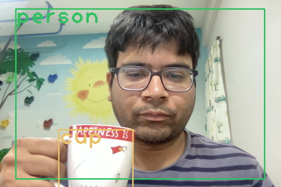


The associated code is in [OpenCV](https://github.com/TSAI-EVA8/YOLO_Session12/blob/master/OpenCV/Yolo_CV2.ipynb)


## Part2:
code: 
[part2](https://github.com/TSAI-EVA8/YOLO_Session12/blob/master/part1/YoloV3Sample_Part1.ipynb)

This part is about training YOLO on a COCO like dataset. The following steps were done:
 1. Fine tune YOLO for 300 epochs. The initial weights were already given at  https://drive.google.com/file/d/1vRDkpAiNdqHORTUImkrpD7kK_DkCcMus/view?usp=share_link

2. The idea is to detect "WALLE" 

3. After training the algo for 300 epochs using the smalcoco dataset here are the results

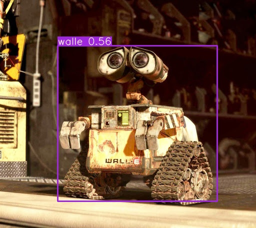

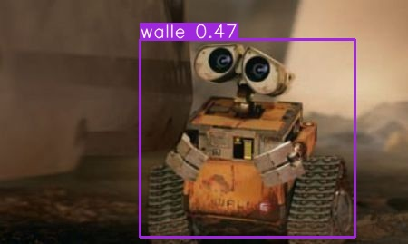

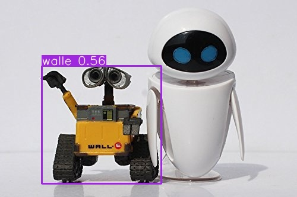

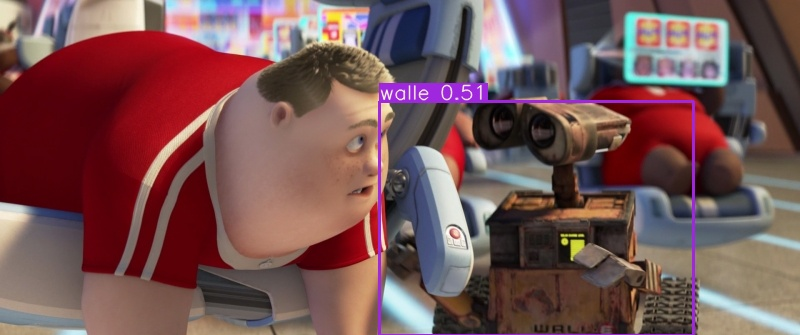


## Part3:
code is [part3](https://github.com/TSAI-EVA8/YOLO_Session12/blob/master/part2/YoloV3Sample_Part2.ipynb)

This is the main part where we need to train the model to detect custom objects . In this case the model is detecting 4 classes instead of just 1

The classes are : **boots**, **vest**, **hats**, **masks**

The dataset is from the previous EVA courses and has been augmented by me

Some of the changes that needed to be done in comparison to part1 (since there are 4 classes)

1. Update the cfg/yolov3-custom.cfg file with the changes of
filters=27
classes=4
as we have 4 classes in the custom dataset

2. Make the following changes to the utlity.py file
```
##line 470
t=t.to(targets.device)
a=a.to(targets.device)

##line 870
ns = int(np.ceil(bs ** 0.5)
```


The model is supposed to be fine tuned for 300 epochs but because of the computation resources constraint I trained for 20 epochs. 
However the results are good even with 20 epochs of the training

Following are some of the samples 

## class: Boots
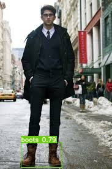
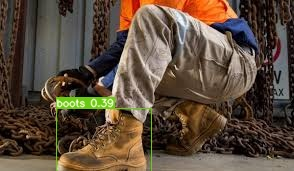

## class: vests
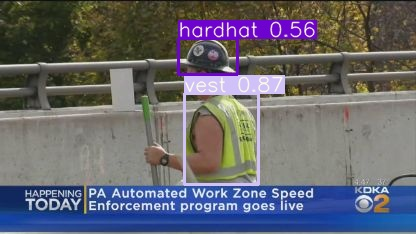
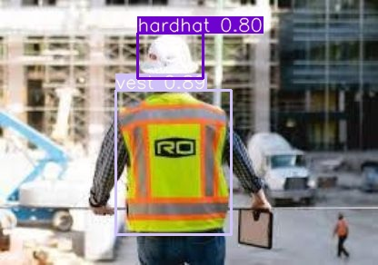

## class: mask
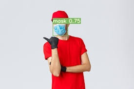
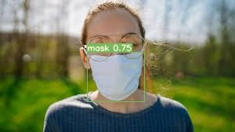


## class: hat
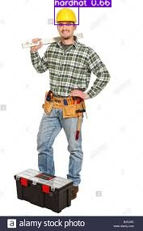
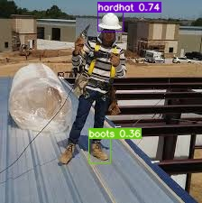


## Youtube video

After the training we were also supposed to create a video for multiple images with object detection done and upload to the youtube

here is the link of the youtube video
** https://www.youtube.com/shorts/bQiKnpnHSbg **


